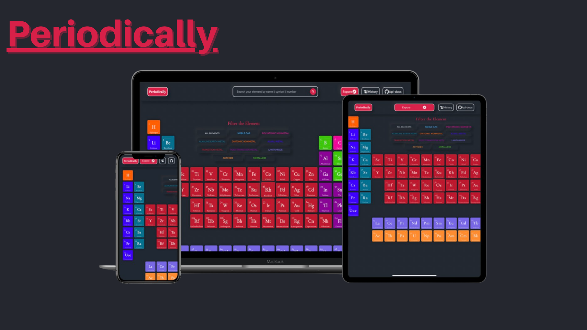
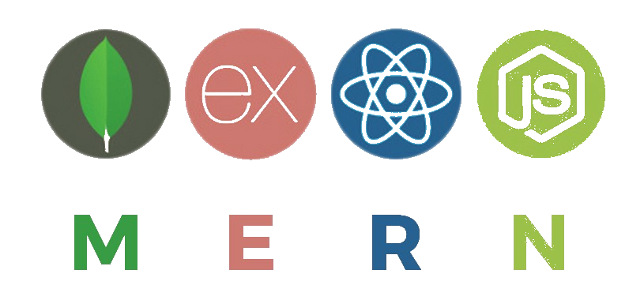
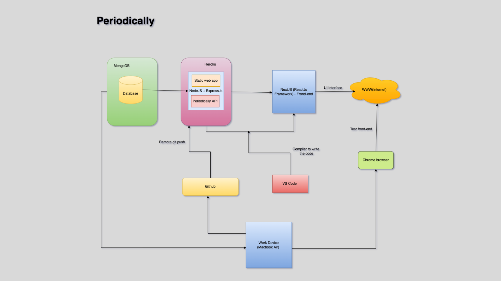

### [Periodically - The Periodic table](https://periodically-webapp.vercel.app/)
<p align="center">

</p>




## ⚛️ Why a periodic table
In **Periodically** web application you will find a huge amount of data about chemical elements for free. You will learn a lot of new and useful for yourself, no matter you are a schoolboy, student, engineer, housewife or a person of any other provisions that does not have a refresher to Chemistry.

The chemistry falls into to number of the most important sciences and is one of the main school obiects.
Its studying begins with the Periodic Table. Interactive approach to a training material is more effective than classical. As in it
technologies which became the family for the modern pupils are used.


## 📌 Discription 

**Periodically** - is a free web application which displays the entire Periodic Table at startup interface. The table has a long-
form approved by the International Union of Pure and Applied Chemistry (IUPAC) as the core. Besides the Periodic Table of
chemical elements, you can use the Table of solubility.

The chemistry falls into to number of the most important sciences and is one of the main school obiects.
Its studying begins with the Periodic Table. Interactive approach to a training material is more effective than classical. As in it
technologies which became the family for the modern pupils are used.


## ✨ Features
- Displays the entire Periodic Table at startup interface.
- Thought of the day.
- When you click on any element provides information that is constantly updated.
- For most of the items have an image.
- For more information, there are direct links to Wikipedia for each item
- Table solubility
- To find any element you can use the search. The search engine is not choosy to the registry or writing style search.
- You can sort the items in 10 categories:
• Alkaline earth metals
• Other nonmetals
Alkali metals
• Halogens
• Transition metals
• Noble gases
• Semiconductor
• Lanthanides
• Metalloids
• Actinides
Elements of the selected category will be listed in the search results and are highlighted in the table on the main application
screen.

## 😎 The Stack used : MERN:


 1. **Node.js** : 
As an asynchronous event-driven JavaScript runtime, Node.js is an extremely powerful JavaScript-based platform used to develop online chat applications, video streaming sites, single-page applications, and many other I/O-intensive web applications and web apps. 

 2. **Express.js** : 
Express is a node js web application framework that provides broad features for building web and mobile applications. It is used to build a single page, multipage, and hybrid web application.
It's a layer built on the top of the Node js that helps manage servers and routes. 

3. **MongoDb** : 
MongoDB is a non-relational document database that provides support for JSON-like storage. The MongoDB database has a flexible data model that enables you to store unstructured data, and it provides full indexing support, and replication with rich and intuitive APIs. 

4. **Next.js/React.js** : 
Next. js is a React framework that gives you building blocks to create web applications. By framework, we mean Next. js handles the tooling and configuration needed for React, and provides additional structure, features, and optimizations for your application.

5. **Additional tech** :  
 Periodically is a fully responsive web appication build using MERN Stack (Next js) which use **Context api** for state manangement, **Tailwind css** for styling and **Material Icon** for icons.
 
## 🛠️  Design Architecture



## 🛠️  Periodically_servers (API)

A simple NodeJS API for **Periodic Table Elements** returns in JSON format.
You can access the data by using this link:


## Expect JSON Data Format


```json
    {
    "name": "Hydrogen",
    "appearance": "colorless gas",
    "atomic_mass": 1.008,
    "boil": 20.271,
    "category": "diatomic nonmetal",
    "color": null,
    "density": 0.08988,
    "discovered_by": "Henry Cavendish",
    "melt": 13.99,
    "molar_heat": 28.836,
    "named_by": "Antoine Lavoisier",
    "number": 1,
    "period": 1,
    "phase": "Gas",
    "source": "https://en.wikipedia.org/wiki/Hydrogen",
    "spectral_img": "https://upload.wikimedia.org/wikipedia/commons/e/e4/Hydrogen_Spectra.jpg",
    "summary": "Hydrogen is a chemical element with chemical symbol H and atomic number 1. With an atomic weight of 1.00794 u, hydrogen is the lightest element on the periodic table. Its monatomic form (H) is the most abundant chemical substance in the Universe, constituting roughly 75% of all baryonic mass.",
    "symbol": "H",
    ":": 1,
    "ypos": 1,
    "shells": [
        1
    ],
    "electron_configuration": "1s1",
    "electron_configuration_semantic": "1s1",
    "electron_affinity": 72.769,
    "electronegativity_pauling": 2.2,
    "ionization_energies": [
        1312
    ],
    "cpk-hex": "ffffff"
    }
```
---


<!-- # How to Contribute

## Prerequisites

Make sure you have the following prerequisites installed on your operating system before you start contributing:

- [Nodejs and npm](https://nodejs.org/en/)

  To verify run:

  ```
  node -v
  ```

  ```
  npm -v
  ```

## Set up your Local Development Environment

Follow the following instructions to start contributing.

**1.** Fork [this](https://github.com/theplayer9/Crypto-Cosmos) repository.

**2.** Clone your forked copy of the project.

```
git clone https://github.com/<your-github-username>/Crypto-Cosmos.git
```

**3.** Navigate to the project directory.

```
cd Crypto-Cosmos
```

**4.** Add a reference(remote) to the original repository.

```
git remote add upstream https://github.com/theplayer9/Crypto-Cosmos.git
```

**5.** Check the remotes for this repository.

```
git remote -v
```

**6.** Always take a pull from the upstream repository to your master branch to keep it at par with the main project (updated repository).

```
  git pull upstream master
```

**7.** Create a new branch.

```
  git checkout -b <your_branch_name>
```

**8.** Install the dependencies for running the site.

```
  npm i
```

**9.** Make the desired changes.

**10.** Run the site locally to preview changes.

```
  npm start
```

**11.** Track your changes.

```
  git add .
```

**12.** Commit your changes. While contributing to this project, you can use signing-off-on-commits for each commit you make.

```
  git commit --signoff -m "<commit subject>"
```

or you could go with the shorter format for the same, as shown below.

```
  git commit -s -m "<commit subject>"
```

**13.** While you are working on your branch, other developers may update the `master` branch with their branch. This action means your branch is now out of date with the `master` branch and missing content. So to fetch the new changes, follow along:

```
  git checkout master
  git fetch origin master
  git merge upstream/master
  git push origin
```

Now you need to merge the `master` branch into your branch. This can be done in the following way:

```
  git checkout <your_branch_name>
  git merge master
```

**14.** Push the committed changes in your feature branch to your remote repo.

```
  git push -u origin <your_branch_name>
```

**15.** Once you’ve committed and pushed all of your changes to GitHub, go to the page for your fork on GitHub, select your development branch, and click the pull request button. Please ensure that you compare your feature branch to the desired branch of the repo you are supposed to make a PR to. If you need to make any adjustments to your pull request, just push the updates to GitHub. Your pull request will automatically track the changes in your development branch and update it.

## 🥁 Features

- Displays the latest updates about the top 100 cryptocurrencies like its market cap, current price, the percentage change in the last 24 hours, profit, etc.
- Shows the behavior of any crypto in chart form with all the stats alongside.
- May choose any among the two currencies i.e INR and USD.
- Can track the growth/fall of any crypto upto last 1 year and display it.

## Scope Of Impovement

- Authentication
- Personalized crypto cart for every user. -->
