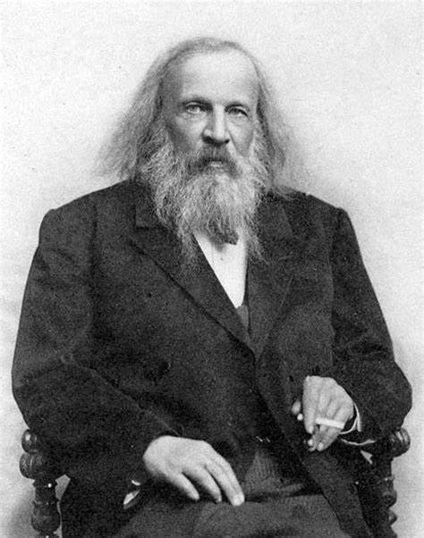

# History

- **Metals and Non-Metals**
_Antoine Lavoisier_, a French chemist, attempted to classify elements as metals and non-metals in 1789. 

- **Döbereiner Triads**
_Johann Wolfgang Döbereiner_, a German physicist, discovered similarities in the physical and chemical properties of certain elements forty years later after Lavoisier's classification. He grouped the similar elements into groups of three in **increasing atomic weight** and named then **triads**, properties of middle element like atomic weight, density were approximately equal to the average of the properties of other two elements. The triads were:

  - Lithium, Sodium, Potassium
  - Calcium, Strontium, Barium 
  - Chlorine, Bromine, Iodine

  For example, lithium(6.9), potassium(39.1) -> average = 23 which is sodium's atomic mass.

  So it can be seen that average atomic masses of first and last element will approximately result in the atomic mass of second element. 

- **Law of Octaves**
_John Newlands_, a British scientist, organised the 62 known elements into the periodic table in the increasing order of their atomic masses. He discovered that every 8th element had similar properties.
He compared the similarity between the elements with the octaves of music where every 8th note is comparable to the first, hence the name.

  - Sodium is one of lithium's eight elements. 
  - Chlorine is the 8th element after Fluorine.
  
  But this was only applicable till calcium and not to the elements with higher atomic masses than calcium. Also, few dissimilar elements were grouped together like halogens with metals such as Cobalt(Co), Nickel(Ni) and Platinum(Pt).
  
  

# About Mendeleev - Father of Periodic Table

_Dmriti Ivanovich Mendeleev_, a Russian chemist, who is best known for developing the **Periodic Law** and creating a version of **periodic table of elements**. He was born in 1783 near Tobolsk in Siberia. He faced a lot of problems from financial issues to health problems like tuberculosis and the demise of his parents.

In his professional life, he worked on **capillarity of liquids** and the workings of **spectroscope**. He also published a textbook named **Principles of Chemistry** which made him won **Demidov Prize**. This book dealt with the elasticity of gases and a major formula for their deviation from Boyle’s law, the principle that the volume of a gas varies inversely with its pressure. After this he studied the thermal expansion too. While working on this book, he accidently discovered the periodic law. Later, he became Doctor of Science for his dissertion on the "Combinations of Water with Alcohol".
He was honored with Noble prize in 1906 for his Periodic Table.

 
 

# Mendeleev's Periodic Table
 

    

 

Mendeleev arranged all 63 elements known at that time in the form of a table i.e. **Mendeleev's Periodic Table**. The elements were arranged in the order of their increasing atomic weights. These series were divided into 7 horizontal columns(periods) and 8 vertical columns(groups). He proposed a Periodic Law:

` "The physical and chemical properties of the elements are the periodic function of their atomic weights." `

One of the major property of his table was that **he left some gaps for the undiscovered elements** which were later found to be correct like Germanium, Scandium and Gallium which were known as Eka - silicon, Eka - boron and Eka - aluminium respectively in the table.

Another important characteristic is that noble gases were placed in a separate group called **Zero Group**, after VIII group without making disturbance to the initial arrangement.